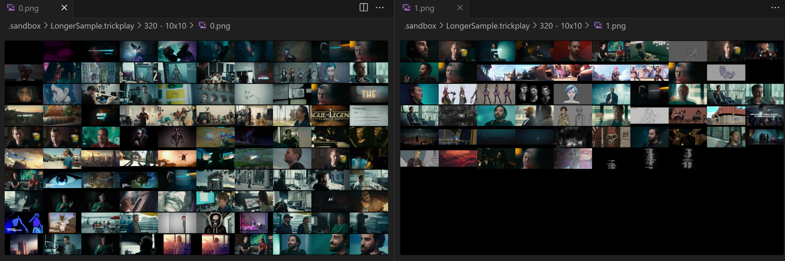
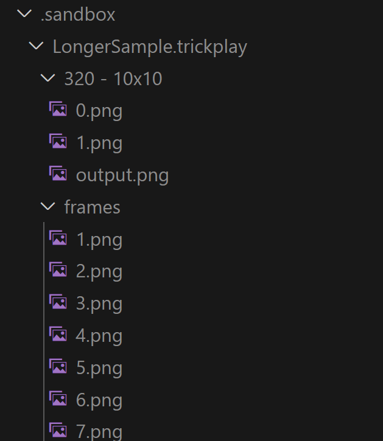

# @bigfootds/nodejs-trickplay

Generate trickplay images for a given video file, for usage in NodeJS environments.

Basically just recreating the Jellyfin approach to trickplay, via NodeJS.

## Installation

This is a scoped package, to the `@bigfootds` namespace. Your installation command should look something like this:

`npm install @bigfootds/nodejs-trickplay`

The dependencies of this package should automatically sort out the `ffmpeg` and `ffprobe` installations for your operating systems.

## Usage

When given an absolute path to a video file, this package will create trickplay data alongside that specified video file.

```js
const { generateTrickplay } = require("@bigfootds/nodejs-trickplay");
const path = require("node:path");

let pathAbsolute = path.resolve("./.sandbox/SomeCoolVideo (2025) - WEBDL-1080p.mkv");

generateTrickplay(pathAbsolute);
```

If you already have raw trickplay frames in a neighbouring `.trickplay` folder for your video content, then you can also skip the frame generation and just use your existing raw trickplay frames.

```js
const { generateTrickplay } = require("@bigfootds/nodejs-trickplay");
const path = require("node:path");

let pathAbsolute = path.resolve("./.sandbox/SomeCoolVideo (2025) - WEBDL-1080p.mkv");

generateTrickplay(pathAbsolute, {skipIndividualFrameGeneration: true});
```

There are additional options available as well, but they are all optional. Anything not specified will fall back to a value in line with a value typical of Jellyfin trickplay behaviour.

```js
{
	// Defaults to a ".trickplay" directory based on the target video file, neighbouring that file.
	trickplayOutputDir?: string;
	// Defaults to 10. Causes frame generation to grab a frame from every X seconds of the target video.
	secondsBetweenFrames?: number;
	// Defaults to 320. The width of the individual frames generated by the system. Works best when smaller than the target video width.
	trickplayImageWidth?: number;
	// Defaults to 10. Determines how many individual frames are squeezed into a single tilesheet.
	trickplaySheetRows?: number;
	// Defaults to 10. Determines how many individual frames are squeezed into a single tilesheet.
	trickplaySheetColumns?: number;
	// Defaults to false. Allows you to use pre-existing individual frames in the trickplayOutDir. Very handy for debugging!
	skipIndividualFrameGeneration?: boolean;


	// Calculated at runtime, try not to use it.
	numberOfFramesToGrab?: number;
	// Calculated at runtime, try not to use it.
	frameTimestamps?: string[];
	
}
```


## More Info

So, given a folder like: 

`Videos/SomeCoolVideo (2025) - WEBDL-1080p.mp4`

This will generate trickplay images and organise them into a nearby folder, adding content to the directory containing the specified video file:

```
- Videos/
	- SomeCoolVideo (2025) - WEBDL-1080p.mp4
	- SomeCoolVideo (2025) - WEBDL-1080p.trickplay/
		- 320 - 10x10/
			- 0.jpg
			- 1.jpg
			- 2.jpg
		- frames/
			- 0.jpg
			- 1.jpg
			- 2.jpg
```

Each trickplay JPG file is a tilesheet of multiple frames from the target video. Longer videos will automatically create multiple tilesheets, constrained by the number of rows and columns you specified when calling the package's function.



Individual frames are kept as well, so you can potentially _not_ use tilesheets in your trickplay implementation for your video player.

